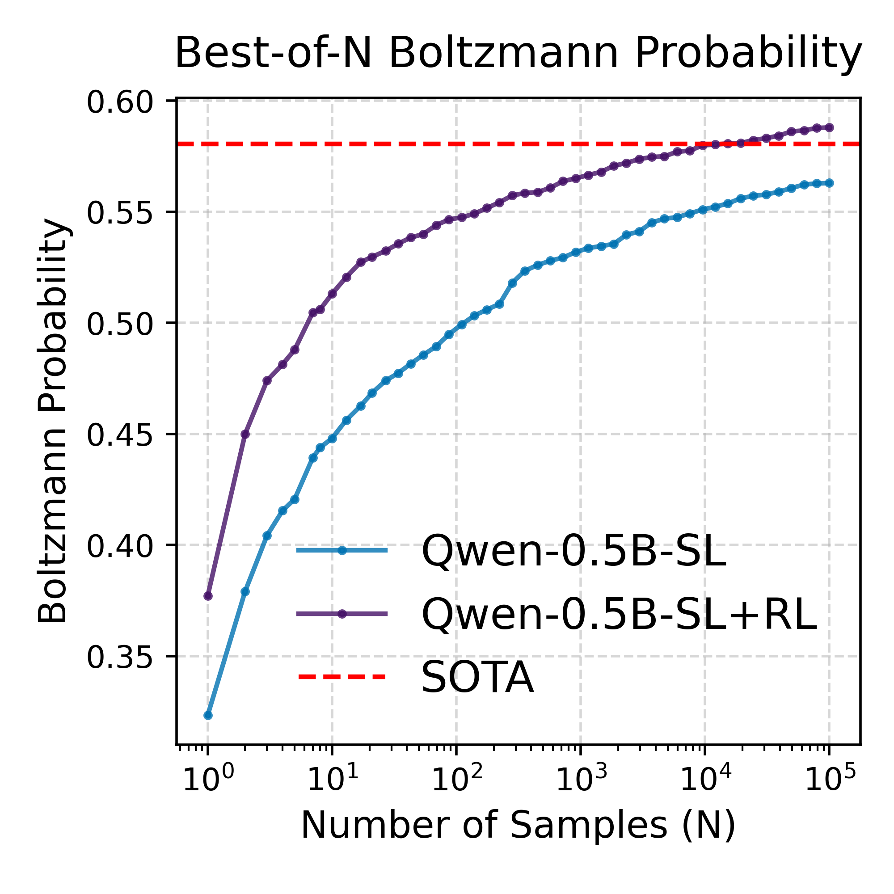

# RNA-Design-LM
RNA-Design-LM is a research codebase for designing RNA sequences with autoregressive language models. Instead of solving each RNA inverse-folding instance from scratch with combinatorial search, we train a conditional LM to map target secondary structures (dot–bracket strings) directly to RNA sequences, combining supervised learning on solver-generated structure–sequence pairs with reinforcement learning that optimizes thermodynamic folding metrics such as Boltzmann probability, ensemble defect, and MFE uniqueness. Constrained decoding enforces base-pairing rules during generation so that all sampled sequences are structurally valid by construction, enabling fast, amortized RNA design at scale.

## Note: All the training data and models for Supervised Learning and RL are available on the Hugging Face Hub. See: [https://huggingface.co/Milanmg/LLM-RNA-Design-2026/tree/main]

## 1. Dependency
pip3 install -r requirements.txt

## 2. Constrained Decoding
This script runs batched inference with an RNA LM on a JSONL test set of target structures, optionally using C++-accelerated constrained decoding (via prefix_allowed_tokens_fn) to enforce Watson–Crick–wobble pairing. It also supports resuming from an existing output file so you don’t waste samples on IDs that are already complete.

### What it does
Reads a JSONL test file with at least: id (unique identifier for each target), target_structure (dot–bracket string). Loads a decoder-only LM from Hugging Face (SL or SL+RL flavor). Builds prompts of the form “structure as chat message” → generate nucleotides. Optionally enforces base-pair constraints during decoding:
Unpaired / opening ( → any of {A,C,G,U} Closing ) → only nucleotides compatible with its partner (CG, GC, AU, UA, GU, UG). Finally writes a JSONL output file with:id, target_structure, designed_sequence (A/C/G/U string) and time (average seconds per sample in that batch)


### Key arguments

#### I/O & model selection
``--test_path``:
Path to test JSONL (default: ./test/eterna100.jsonl).
Each line should be a JSON dict with id and target_structure. \
``--output_path``:
Where to write generated designs (JSONL).
If empty, a default is derived as
./decoding_results/{test_file_stem}_{model_flavor}.jsonl. For example: --test_path ./test/eterna100.jsonl --model_flavor slrl → ./decoding_results/eterna100_slrl.jsonl \
``--model_flavor``: {sl, slrl} Which trained model flavor to use: sl = supervised-only model, slrl = SL+RL model (default) \
``--sl_model_path``:
Default HF path for the SL model
(default: Milanmg/LLM-RNA-Design-2025/model/SL) \
``--slrl_model_path``:
Default HF path for the SL+RL model
(default: Milanmg/LLM-RNA-Design-2025/model/SL+RL) 


#### Sampling / decoding 
``--n_repeats``: Number of samples to generate per id (default: 1000).\
``--batch_size``: Number of structures per generation batch (default: 1024).\
``--do_sample``: If set, use sampling; otherwise defaults to greedy-like decoding.\
``--temp``: Sampling temperature (default: 2.0).\
``--top_p``: Nucleus-sampling top_p (default: 1.0 = no truncation).\
``--max_decode_tokens``: Maximum number of new tokens to generate (default: 512).

#### Constrained decoding & ID subset
``--constrained_decode``: If set, enables structure-aware constrained decoding that enforces base-pair rules. \
``--constrained_id``: Optional list of integer IDs. If provided, only those IDs are decoded (others are skipped).

#### Resume behavior
``--resume_remaining / --no-resume_remaining``:\
Default: --resume_remaining (True)\
True: read output_path, count existing samples per id, and only generate the remaining repeats.\
False: ignore any existing output and start from scratch (file opened in w mode).\
The script logs how many IDs are fully done, partially done, and not started, then processes the remaining “tasks” in batches.

#### Example: SL+RL model with constrained decoding
```python
python ./scripts/constrained_decoding.py \
  --test_path ./test/eterna100.jsonl \
  --model_flavor slrl \
  --n_repeats 100 \
  --batch_size 1024 \
  --do_sample \
  --temp 2 \
  --constrained_decode 
```
Should see something like this:
```
python constrained_decoding.py   --test_path ./test/eterna100.jsonl   --model_flavor slrl   --n_repeats 1000   --
batch_size 1024   --do_sample   --temp 2   --constrained_decode 
13:18:26 INFO Using model_flavor=slrl, model_path=Milanmg/LLM-RNA-Design-2025/model/SL+RL
13:18:26 INFO Resolved repo_id='Milanmg/LLM-RNA-Design-2025', subfolder='model/SL+RL'
13:18:26 INFO No --output_path provided. Using derived path from test_path: ./eterna100_decoding_results.jsonl
13:18:26 INFO Loading model & tokenizer from repo_id='Milanmg/LLM-RNA-Design-2025', subfolder='model/SL+RL'
13:18:28 INFO We will use 90% of the memory on device 0 for storing the model, and 10% for the buffer to avoid OOM. You can set `max_memory` in to a higher value to use more memory (at your own risk).
13:18:29 INFO Loaded 100 test records from ./test/eterna100.jsonl
13:18:29 INFO Resume enabled: found 0 existing samples across 0 unique ids in ./eterna100_decoding_results.jsonl
13:18:29 INFO ID sampling status: considered=100, completed=0, partial=0, not_started=100, remaining_tasks=100000
13:18:29 INFO Not-started examples (preview): 8, 1, 23, 26, 15, 30, 88, 41, 3, 11, 57, 66, 40, 65, 20, 10, 33, 47, 62, 27
13:18:29 INFO 100000 tasks in 98 batches
13:18:30 INFO Batch 1/98: size=1024, prefix_len=19
13:18:31 INFO   Constrained generate() took 1.38s
13:18:31 INFO Batch 2/98: size=1024, prefix_len=20
13:18:32 INFO   Constrained generate() took 0.93s
13:18:32 INFO Batch 3/98: size=1024, prefix_len=29
13:18:33 INFO   Constrained generate() took 1.40s
13:18:33 INFO Batch 4/98: size=1024, prefix_len=33
13:18:35 INFO   Constrained generate() took 1.67s
```

#### Example: SL model + fresh run
```python
python ./scripts/constrained_decoding.py \
  --test_path ./test/eterna100.jsonl \
  --model_flavor sl \
  --n_repeats 100 \
  --batch_size 1024 \
  --temp 2 \
  --do_sample \
  --constrained_decode \
  --no-resume_remaining
```
## 2. Best-of-N evaluation & plotting (plot BON script)
This script takes one or more JSONL result files (e.g., outputs from constrained_decoding.py or other solvers), evaluates each designed sequence with a thermodynamic oracle (eval_design), caches the metrics, and then produces Best-of-N curves comparing experiments to a strong SOTA baseline (e.g., SAMFEO).

### Key arguments

``--results``:   List of JSONL result files, one per experiment. \
                 Example: --results ./decoding_results/eterna100_sl.jsonl ./decoding_results/eterna100_slrl.jsonl \
``--exp_names``: List of human-readable names (same length as --results) used in the plot legends.
                 Example: --exp_names SL SL+RL \
``--sota``:      Path to the SOTA JSONL file (e.g., SAMFEO outputs). Must contain compatible fields (id, target_structure, designed_sequence, etc.). (default: ./decoding_results/eterna100_SAMFEO.jsonl)\
``--out_dir``: Directory where plots will be saved (default: ./plots_bon/Eterna_bo100). \
``--max_n``: Maximum N for Best-of-N curves (default: 1000). Actual max may be limited by the smallest number of runs per ID. \
``--max_turns``: Max turns to plot for other analyses (currently not reached because the script exits after Best-of-N plots). \
``--n_workers``: Number of processes used for parallel evaluation (default: 50). Set this based on CPU cores and memory. \
``--log-base {2, 10}``: If set, x-axis for Best-of-N is logarithmic with that base (e.g., 2 or 10). If omitted, plots use a linear x-axis. \
``--cache_path``: Path to a Parquet cache storing previous eval_design results (default: ./eval_cache_sept.parquet).If file exists, it is loaded and reused. If not, it is created. Speeds up repeated evaluations across runs/experiments.

### Example: compare SL vs SL+RL vs SAMFEO on Eterna100
```
python scripts/plot_bon.py \
  --results \
    ./decoding_results/eterna100_sl.jsonl \
    ./decoding_results/eterna100_slrl.jsonl \
  --exp_names \
    SL \
    SL+RL \
  --sota ./decoding_results/eterna100_SAMFEO.jsonl \
  --out_dir ./plot_bon/Eterna_bo100 \
  --max_n 1000 \
  --n_workers 32 \
  --log-base 10 \
  --cache_path ./eval_cache_sept.parquet
```

